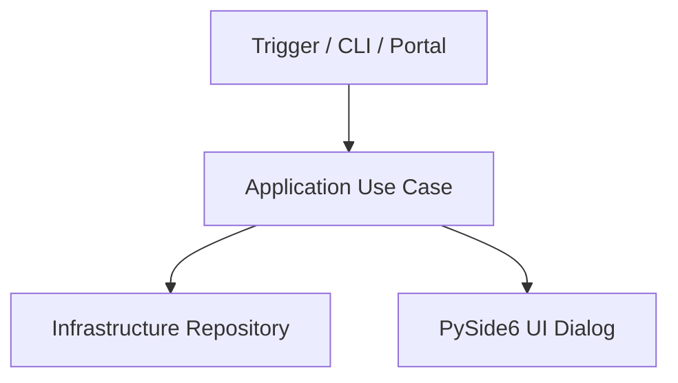

# Specification Generator & Project Documentation Standards

Guidelines, workflow practices, and standardized Markdown templates for generating and maintaining technical documentation, software specifications, architecture blueprints, and Architectural Decision Records (ADRs) within the `spec/` folder.

## When to Activate

- Creating technical specifications for new features or modules before or during implementation.
- Reverse-engineering and documenting existing undocumented modules or architecture.
- Documenting system-level contracts (IPC protocols, CLI inputs/outputs, D-Bus interfaces, desktop environment requirements).
- Recording architectural choices, trade-offs, and design decisions (ADRs).
- Auditing or reviewing existing project documentation for completeness and accuracy.

---

## 1. Directory Structure Standards (`spec/`)

All technical specifications must be organized under the root `spec/` directory using the following hierarchy:

```text
spec/
├── architecture/         # High-level system structure, IPC protocols, and component interaction
│   ├── overview.md       # Global architecture, layer boundaries, and execution model
│   └── portal-ipc.md     # Specific subsystem architecture (e.g. XDG Desktop Portal contract)
├── features/             # Feature specifications and functional requirements
│   ├── screen-sharing.md # Screen sharing / portal chooser specification
│   ├── display-swap.md   # Multi-monitor switching specification
│   └── wallpaper.md      # Wallpaper management specification
├── modules/              # Detailed specs for core packages and layers
│   ├── domain.md         # Domain entities, value objects, and repository interfaces
│   ├── infrastructure.md # Sway IPC, D-Bus, Sysfs, subprocess integrations
│   └── presentation.md   # CLI router, PySide6 windows, and OSD widgets
└── adrs/                 # Architectural Decision Records (ADRs)
    ├── 0001-xdg-portal-integration.md
    └── 0002-daemon-client-ipc-model.md
```

---

## 2. Core Specification Principles

1. **Source of Truth**: Specs in `spec/` define expected software behavior, boundary contracts, and architectural invariants.
2. **Explicit Contracts**: Always define exact technical inputs/outputs (CLI arguments, IPC messages, D-Bus methods/signals, JSON structures, stdout/stderr invariants).
3. **Diagrams Over Text**: Use `mermaid` block diagrams for component relationships, message flows, state machines, and sequence diagrams.
4. **Traceability**: Every specification item must link to observable code paths and test verification points.
5. **Living Documentation**: Update specs alongside code changes. Outdated specifications create technical debt.

---

## 3. Specification Workflow

When generating specifications:

1. **Investigate Context**: Inspect source code, entry points (`src/main.py`, `src/gui_main.py`), and layer dependencies (`domain/`, `application/`, `infrastructure/`, `presentation/`).
2. **Identify Category**:
   - High-level system interaction $\rightarrow$ `spec/architecture/`
   - User-facing feature / CLI capability $\rightarrow$ `spec/features/`
   - Internal layer / domain model contract $\rightarrow$ `spec/modules/`
   - Key design choice / trade-off $\rightarrow$ `spec/adrs/`
3. **Apply Standard Template**: Use one of the templates in Section 4.
4. **Verify Contracts**: Ensure technical details (CLI commands, stdout/stderr separation, exit codes, IPC flags) match actual codebase implementations.
5. **Add Acceptance & Verification Criteria**: Detail exact commands or tests required to validate compliance with the specification.

---

## 4. Standard Templates

### 4.1 Feature Specification Template (`spec/features/<feature-name>.md`)

```markdown
# Feature Spec: <Feature Name>

## 1. Overview & Objective
Brief summary of the feature, business goal, and target user workflow.

## 2. Scope & Responsibilities
### In Scope
- Requirement 1
- Requirement 2

### Out of Scope
- Non-goal 1
- Non-goal 2

## 3. Contracts & Interfaces
### CLI Commands / Triggers
```bash
SwayManager <command> [args]
```

### Input / Output Contracts
- **Input**: CLI flags, configuration fields, environment variables.
- **Output (stdout)**: Strict formatting requirements (e.g. `Monitor: <name>`, JSON payloads).
- **Diagnostics / Logs (stderr/file)**: Log targets (`~/.config/sway-manager/logs/`).

## 4. Architecture & Component Flow


## 5. UI / UX Specifications (If Applicable)
- **Window Flags & Behavior**: Modal, Frameless, Top-most, Offscreen safe.
- **Visual Styling**: Dark/Light mode theme tokens (`styles.py`), HIG standards.
- **Keyboard Navigation**: Focus chain, Enter to confirm, Esc to cancel, arrow key selection.

## 6. Error Handling & Edge Cases
| Condition | System Behavior | User Impact / Error Message |
|---|---|---|
| Hardware missing | Graceful fallback | Warning in stderr / UI message |
| IPC Failure | Return non-zero code | Log error to async logger |

## 7. Acceptance Criteria & Verification
- [ ] Command `SwayManager <feature>` opens expected interface / executes logic.
- [ ] Unit tests in `tests/test_<feature>.py` pass.
- [ ] Stdout contract strictly respected without debug log leakage.
```

---

### 4.2 Module Specification Template (`spec/modules/<module-name>.md`)

```markdown
# Module Spec: <Module Name>

## 1. Module Overview
Package path (`src/<package>/`), responsibilities, and layer placement.

## 2. Architecture & Layer Position
- **Layer**: Domain | Application | Infrastructure | Presentation
- **Upstream Dependencies**: External tools, libraries, or lower layers.
- **Downstream Callers**: Use cases, CLI handlers, or GUI widgets consuming this module.

## 3. Class & Interface Definitions

### `I<RepositoryName>` (Abstract Interface)
```python
class IExampleRepository(ABC):
    @abstractmethod
    def execute_action(self, param: ParamType) -> ResultType:
        """Description of expected behavior."""
```

### Implementation: `<ConcreteRepository>`
- **Subprocess / External Calls**: `swaymsg`, `brightnessctl`, `sysfs`, `cliphist`.
- **Invariants**: Exception handling strategy (`SwayException`), fallback behavior.

## 4. Data Models & Entities
Data transfer objects, Dataclasses, or Enums used by the module.

## 5. Testing Strategy
- Mocking strategy for external binaries/sockets.
- Key test scenarios covering standard execution and failure modes.
```

---

### 4.3 Architectural Decision Record Template (`spec/adrs/<0000-title>.md`)

```markdown
# ADR <Number>: <Title>

- **Status**: Proposed | Accepted | Deprecated | Superseded by ADR-<N>
- **Date**: YYYY-MM-DD
- **Authors**: <Name/Team>

## Context & Problem Statement
What context leads to this decision? What problem are we trying to solve?

## Decision Drivers
- Driver 1 (e.g. Compatibility with xdg-desktop-portal-wlr)
- Driver 2 (e.g. Strict separation of stdout and logging)

## Considered Options
1. Option 1: <Description>
2. Option 2: <Description>

## Decision Outcome
Chosen Option: **<Option Name>**

### Positive Consequences
- Benefit 1
- Benefit 2

### Negative Consequences / Trade-offs
- Limitation 1
- Required follow-up work

## Validation & Verification
How the implementation of this decision is verified.
```

---

### 4.4 System Architecture Overview Template (`spec/architecture/overview.md`)

```markdown
# SwayManager System Architecture

## 1. System Overview
High-level overview of SwayManager daemon, CLI commands, PySide6 GUI tools, and Wayland/Sway integrations.

## 2. Layered Architecture
```mermaid
graph TB
    subgraph Presentation Layer
        CLI[CLI Router & Handlers]
        GUI[PySide6 Windows & OSDs]
    end

    subgraph Application Layer
        UC[Use Cases]
    end

    subgraph Domain Layer
        Entities[Domain Entities & Value Objects]
        Interfaces[Repository Interfaces]
    end

    subgraph Infrastructure Layer
        SwayIPC[Sway Display Repo]
        BatterySys[Sysfs Battery Repo]
        PortalRepo[XDG Portal Integration]
        Daemon[Daemon Server / Client IPC]
    end

    CLI --> UC
    GUI --> UC
    UC --> Interfaces
    Interfaces <|-- SwayIPC
    Interfaces <|-- BatterySys
    Interfaces <|-- PortalRepo
```

## 3. Communication & Execution Models
- **Daemon-Client Socket Protocol**: Async Unix Domain Socket IPC.
- **Portal Chooser Contract**: Subprocess execution by `xdg-desktop-portal-wlr` via `stdout` line protocol.
- **Sway IPC**: Direct binary invocation of `swaymsg` and JSON parsing.

## 4. Safety, Logging & Resilience
- Non-blocking `AsyncLogger` for file-based logging.
- `setup_qt_environment()` resilience flags for Wayland.
```

---

## 5. Validation & Quality Checklist for `spec/`

When reviewing or creating documentation in `spec/`:

- [ ] File is placed in the correct subfolder (`architecture/`, `features/`, `modules/`, or `adrs/`).
- [ ] All code paths and command names match the codebase accurately.
- [ ] Technical interfaces specify explicit types, flags, and formats.
- [ ] Diagrams use standard `mermaid` syntax.
- [ ] Markdown follows standard header hierarchy (`#`, `##`, `###`).
