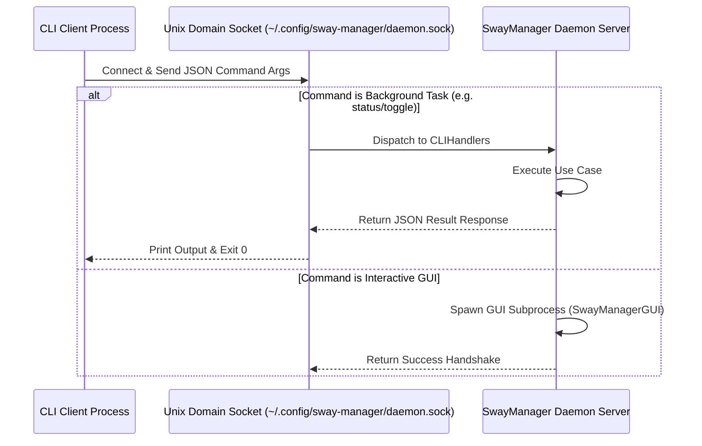
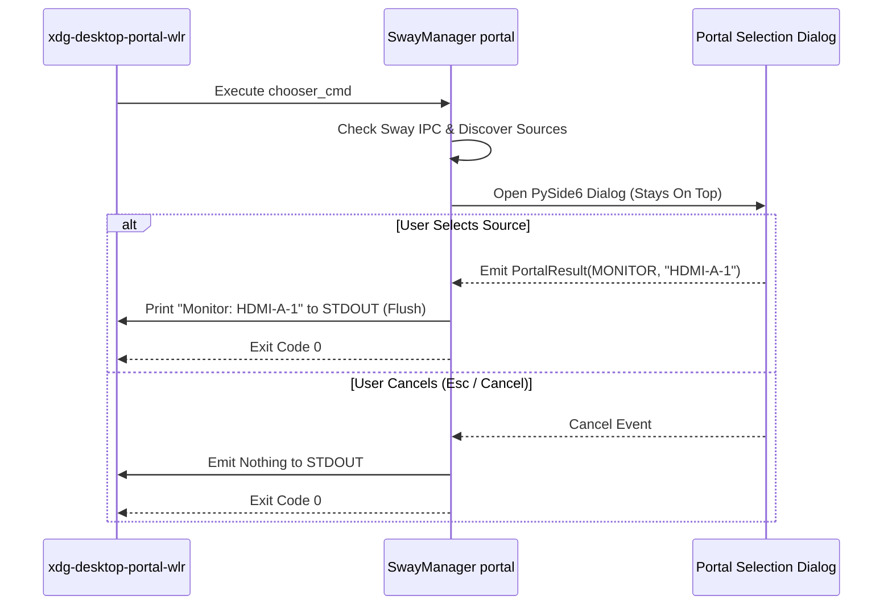

# SwayManager System Architecture Overview

## 1. System Overview

**SwayManager** is a management suite and desktop integration system built for Sway and SwayFX compositors under Wayland. It provides high-performance CLI commands, interactive PySide6 GUI interfaces, on-screen displays (OSD), system controls (battery, idle, power profiles, brightness, volume, wallpaper), and screen sharing integration for the XDG Desktop Portal system.

The application follows Clean Architecture principles, ensuring a strict separation between business entities, use cases, hardware/compositor integration, and presentation interfaces.

---

## 2. Layered Architecture

```mermaid
graph TB
    subgraph Presentation Layer
        CLI[CLI Router & Handlers]
        GUI[PySide6 Windows & Control Center]
        OSD[OSD Overlay Widgets]
        PortalGUI[Portal Chooser Dialog]
    end

    subgraph Application Layer
        UC_Display[Display Use Cases]
        UC_Power[Power & Battery Use Cases]
        UC_Theme[Theme & Wallpaper Use Cases]
        UC_Media[Media & Screenshot Use Cases]
        UC_Audio[Audio Use Cases]
    end

    subgraph Domain Layer
        Entities[Domain Entities & Value Objects]
        RepoInterfaces[Repository Interfaces]
    end

    subgraph Infrastructure Layer
        SwayIPC[Sway Display Repository]
        BatterySysfs[Sysfs Battery Repository]
        SwayIdle[SwayIdle Repository]
        SwayLock[SwayLock Repository]
        CliphistRepo[Cliphist Clipboard Repository]
        AsyncLog[Async Logger]
        DaemonIPC[Daemon Server & Client IPC]
    end

    subgraph Portal Module
        PortalCtrl[Portal Controller]
        PortalProv[Outputs & Window Providers]
        PortalWriter[Portal Result Writer]
    end

    CLI --> UC_Display
    CLI --> UC_Power
    CLI --> UC_Theme
    CLI --> UC_Media
    CLI --> UC_Audio
    CLI --> PortalCtrl

    GUI --> UC_Display
    GUI --> UC_Power
    GUI --> UC_Theme

    PortalCtrl --> PortalProv
    PortalCtrl --> PortalWriter
    PortalCtrl --> PortalGUI

    UC_Display --> RepoInterfaces
    UC_Power --> RepoInterfaces
    UC_Theme --> RepoInterfaces
    UC_Media --> RepoInterfaces
    UC_Audio --> RepoInterfaces

    RepoInterfaces <|.. SwayIPC
    RepoInterfaces <|.. BatterySysfs
    RepoInterfaces <|.. SwayIdle
    RepoInterfaces <|.. SwayLock
    RepoInterfaces <|.. CliphistRepo
```

### Layer Breakdown

1. **Domain Layer (`src/domain/`)**: Pure Python domain models, value objects, and abstract repository contracts (`IDisplayRepository`, `IBatteryRepository`, `IWallpaperRepository`). Free of third-party UI or OS dependencies.
2. **Application Layer (`src/application/`)**: Use cases implementing business flows (`SwitchDisplayModeUseCase`, `ToggleBatteryConservationUseCase`, `SetWallpaperUseCase`).
3. **Infrastructure Layer (`src/infrastructure/`)**: Concrete implementations communicating with Sway IPC (`swaymsg`), Linux sysfs (`/sys/class/power_supply`), audio subsystems (`amixer`/`wpctl`), D-Bus, and system binaries (`swaylock`, `wofi`, `cliphist`, `brightnessctl`).
4. **Presentation Layer (`src/presentation/`)**:
   - `cli/`: Router and subcommand handlers (`SwayManager monitor`, `SwayManager portal`, etc.).
   - `gui/`: PySide6 windows, control center, popups, and OSD overlays styled according to Apple HIG.
5. **Portal Subsystem (`src/portal/`)**: Dedicated module coordinating XDG Desktop Portal ScreenCast selection, provider discovery, and stdout result formatting.

---

## 3. Communication & Inter-Process Execution Models

### 3.1 Daemon Server & Client Model



### 3.2 Chooser Subprocess Contract (`xdg-desktop-portal-wlr`)



---

## 4. Resilience & Runtime Environments

1. **Wayland Qt Resilience**:
   Environment flags set before Qt initialization in `setup_qt_environment()`:
   ```python
   QT_WAYLAND_RECONNECT = "1"
   QT_QPA_PLATFORM = "wayland;xcb"
   ```
2. **Memory Trim & Cache Cap**:
   - `QPixmapCache` limited to 2MB via `setup_qt_cache()`.
   - `ApplicationFactory._cleanup_memory()` invokes `ctypes.CDLL("libc.so.6").malloc_trim(0)` and `gc.collect()` upon widget deletion.
3. **Non-Blocking File Logging**:
   - `AsyncLogger` runs a dedicated daemon thread with an `asyncio` loop to write log messages without blocking CLI execution or rendering frames. Log target: `~/.config/sway-manager/logs/log-YYYY-MM-DD.txt`.
