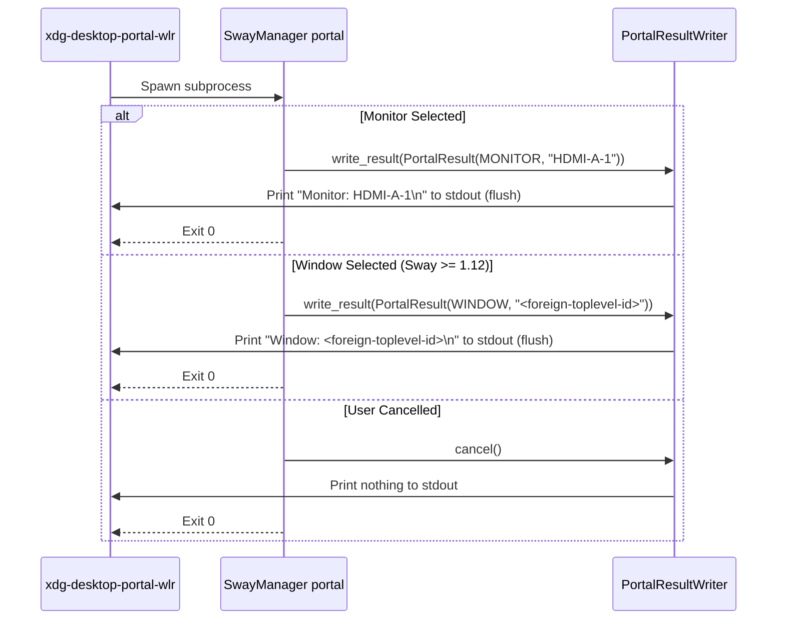
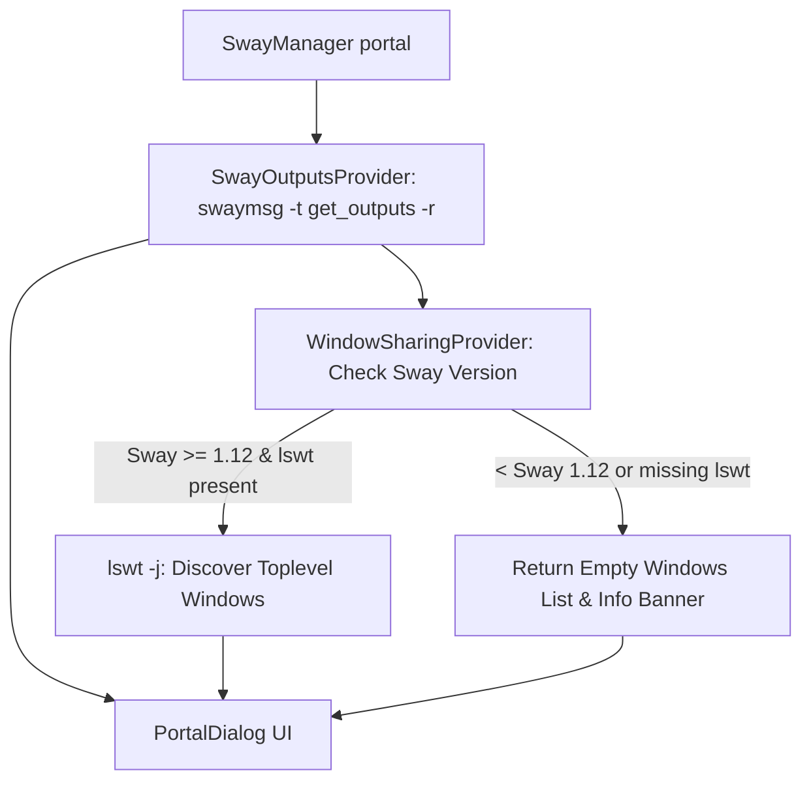

# XDG Desktop Portal Integration Architecture

## 1. System Integration Overview

SwayManager integrates with `xdg-desktop-portal` and `xdg-desktop-portal-wlr` to act as the native visual source chooser for Wayland ScreenCast requests.

When an application (such as OBS Studio, Firefox, Chrome, or Discord) requests screen sharing via PipeWire, `xdg-desktop-portal-wlr` invokes `SwayManager portal` as a subprocess (`chooser_cmd`). SwayManager displays a PySide6 source selector and returns the technical source identifier over `stdout`.

---

## 2. D-Bus & Session Environment Activation

For D-Bus activated portal services to communicate with Sway, the session variables must be exported to the systemd user instance during Sway startup.

### Sway Startup Exec Line
```text
exec dbus-update-activation-environment --systemd WAYLAND_DISPLAY XDG_CURRENT_DESKTOP=sway
```

### Managed Environment Variables
| Variable | Mandatory | Purpose |
|---|---|---|
| `WAYLAND_DISPLAY` | Yes | Path to Wayland socket (e.g. `wayland-1`) |
| `XDG_CURRENT_DESKTOP` | Yes | Identifies desktop environment (`sway`) |
| `SWAYSOCK` | Optional | Path to Sway IPC socket |
| `XDG_SESSION_TYPE` | Optional | Session backend (`wayland`) |

---

## 3. Configuration Contract & Installer Mechanics

### 3.1 Portal Preference Config (`~/.config/xdg-desktop-portal/portals.conf`)

```ini
[preferred]
default=gtk
org.freedesktop.impl.portal.Screenshot=wlr
org.freedesktop.impl.portal.ScreenCast=wlr
```

### 3.2 WLR Chooser Config (`~/.config/xdg-desktop-portal-wlr/config`)

```ini
[screencast]
chooser_type=simple
chooser_cmd=/home/USER/.config/sway/bin/SwayManager portal
max_fps=30
```

### 3.3 Backup Invariants
`PortalConfigInstaller` enforces strict safety when writing configuration files:
1. Creates a timestamped backup before modifying any existing config: `<filename>.YYYYMMDD-HHMMSS.bak`.
2. Preserves all unrelated INI keys and sections.
3. Automatically restarts user systemd units: `xdg-desktop-portal-wlr` and `xdg-desktop-portal`.

---

## 4. Chooser Output Protocol

The communication between `xdg-desktop-portal-wlr` and `SwayManager portal` relies exclusively on `stdout`.



### Stdout vs Stderr Separation Rule
- **STDOUT**: Reserved strictly for the result string (`Monitor: <id>` or `Window: <id>`). No logs, warnings, or debug messages may enter stdout.
- **STDERR / File Logs**: All diagnostic messages, errors, and status outputs must go to `stderr` or `~/.config/sway-manager/logs/`.

---

## 5. Source Discovery & Versioning Rules



- **Monitors**: Extracted directly via `swaymsg -t get_outputs -r`. Identifiers are output technical names (e.g. `eDP-1`, `HDMI-A-1`).
- **Windows**: Requires Sway 1.12+ (ext-foreign-toplevel-list-v1) and `lswt`. On older Sway/SwayFX versions, window sharing tab displays an informative notice and falls back gracefully to full-screen sharing.
