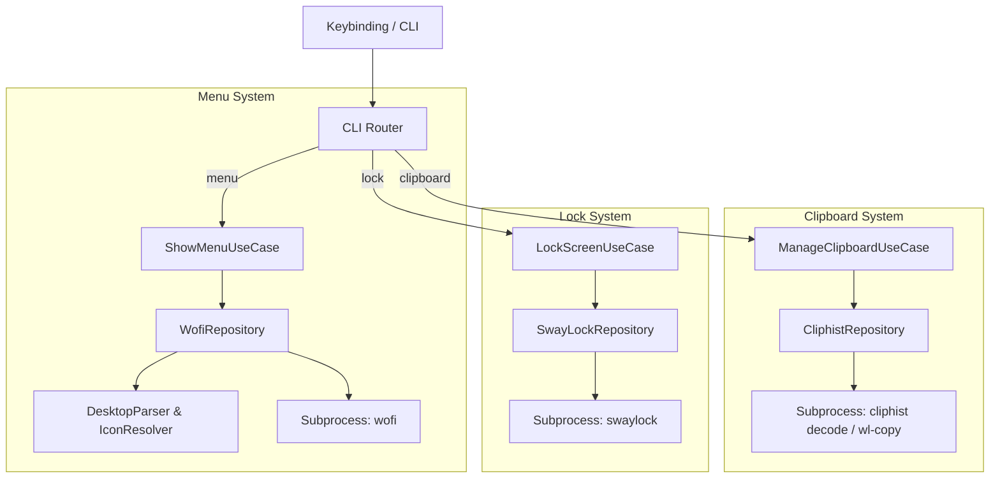

# Feature Spec: Clipboard Manager, Application Menu & Screen Lock (`clipboard`, `menu`, `lock`)

## 1. Overview & Objective
Provides desktop utility commands integrating custom Wofi application launchers, Cliphist clipboard history with pinned favorites, and styled screen locking via `swaylock`.

---

## 2. Scope & Responsibilities

### In Scope
- Application Launcher (`SwayManager menu`): Parsing `.desktop` files, categorizing apps, resolving desktop icons, filtering DE-specific items, executing selections via `wofi`.
- Clipboard Manager (`SwayManager clipboard`): Querying `cliphist`, decoding clipboard items, managing pinned favorite clips in JSON storage, launching Wofi picker.
- Lock Screen (`SwayManager lock`): Generating wallpaper-based swaylock configuration according to active dark/light desktop theme and executing `swaylock`.

---

## 3. Contracts & Interfaces

### CLI Commands
```bash
SwayManager menu [categoria]
SwayManager clipboard [clear|pin]
SwayManager lock
```

### Subsystem Dependencies
| Feature | Subprocess / Executable | Configuration / Storage Path |
|---|---|---|
| Menu | `wofi`, `gio`, `.desktop` files | `/usr/share/applications/`, `~/.local/share/applications/` |
| Clipboard | `cliphist`, `wl-copy`, `wofi` | `~/.config/sway-manager/clipboard_favorites.json` |
| Lock | `swaylock` | Active wallpaper & GTK/Qt theme colors |

---

## 4. Architecture & Component Flow



---

## 5. Acceptance Criteria & Verification
- [ ] `SwayManager menu` opens custom styled Wofi application menu.
- [ ] `SwayManager clipboard` presents cliphist items and copies selected item to `wl-copy`.
- [ ] `SwayManager lock` locks the display using active wallpaper and theme colors.
- [ ] Unit tests in `tests/test_menu.py`, `tests/test_clipboard.py`, `tests/test_lock_repository.py` pass cleanly.
