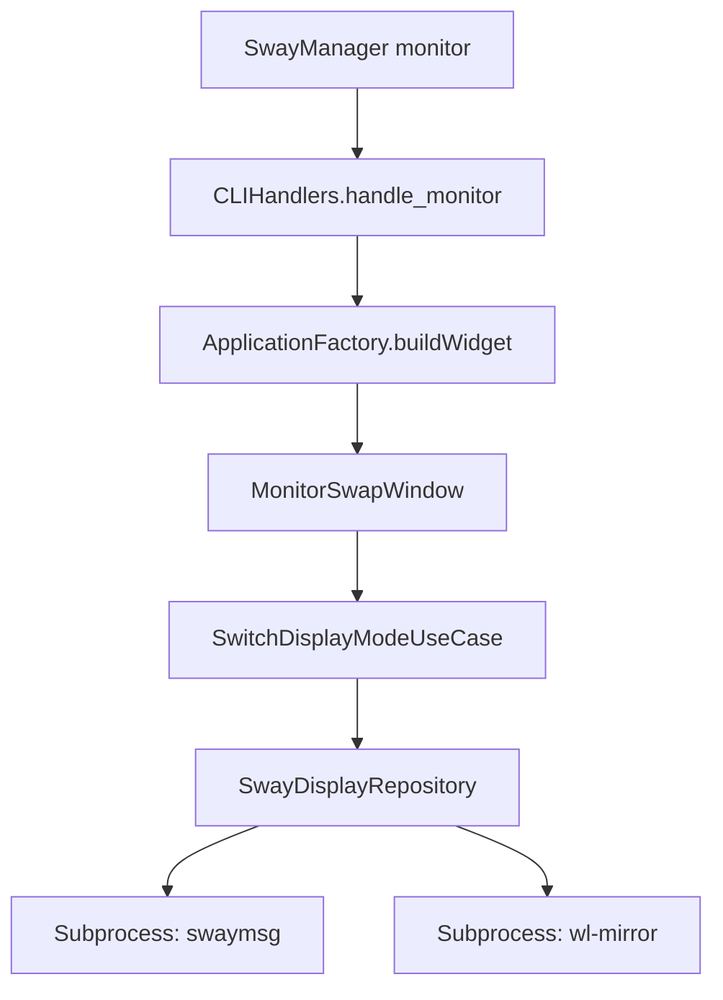

# Feature Spec: Multi-Monitor Layout Switcher (`monitor`)

## 1. Overview & Objective
Allows users to quickly switch multi-monitor display configurations under Sway (Laptop screen only, External monitor only, Extend displays, or Duplicate display). Provides both an interactive PySide6 overlay (`MonitorSwapWindow`) and headless CLI application logic.

---

## 2. Scope & Responsibilities

### In Scope
- Detecting connected monitors via `swaymsg -t get_outputs`.
- Classifying internal display (`eDP-1` / `eDP-2`) vs external display (`HDMI-A-1`, `DP-1`).
- Applying output configurations (`swaymsg output <id> enable|disable`).
- Launching `wl-mirror` for hardware-accelerated screen duplication.
- Presenting a top-most, frameless PySide6 selection overlay with quick-action cards.

---

## 3. Contracts & Interfaces

### CLI Command
```bash
SwayManager monitor [mode]
```

### Supported Layout Modes (`DisplaySwitchType`)
| Mode | Value | Logic / Command Executed |
|---|---|---|
| `PC_ONLY` | `0` | `swaymsg output <internal> enable, output <external> disable` |
| `DUPLICATE` | `1` | `swaymsg output <internal> enable, output <external> enable; pkill wl-mirror; wl-mirror <internal>` |
| `EXTEND` | `2` | `swaymsg output <internal> enable, output <external> enable` |
| `MONITOR_ONLY` | `3` | `swaymsg output <internal> disable, output <external> enable` |

---

## 4. Architecture & Component Flow



---

## 5. UI / UX Specifications
- **Window Hint**: `FramelessWindowHint`, `WindowStaysOnTopHint`, `WA_TranslucentBackground`.
- **Desktop File**: `sway.apps.monitor-swap`.
- **Keyboard Shortcuts**:
  - `Esc`: Close window without changing layout.
  - Number keys or card click: Apply corresponding layout mode.

---

## 6. Acceptance Criteria & Verification
- [ ] `SwayManager monitor` opens the frameless display selection overlay.
- [ ] Selecting "Estender" enables both monitors via `swaymsg`.
- [ ] Selecting "Duplicar" launches `wl-mirror` targeting the internal display.
- [ ] Unit tests in `tests/test_display_repository.py` pass cleanly.
