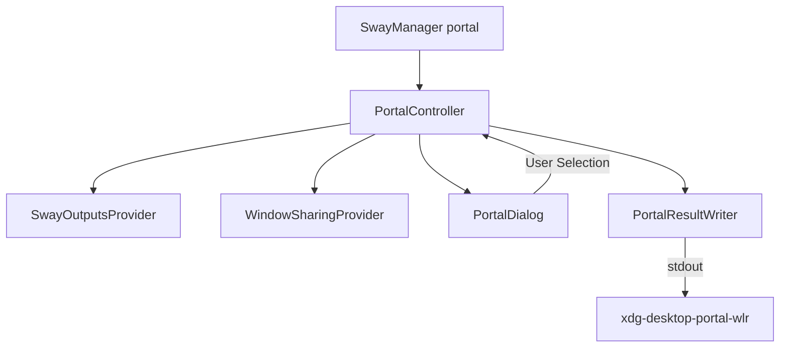

# Feature Spec: Screen Sharing & XDG Portal Selector

## 1. Overview & Objective
Provides an interactive PySide6 graphical source chooser when an external application requests screen capture through the XDG Desktop Portal system. Allows users to select an active monitor or individual window (on supported compositors) and returns the technical identifier to `xdg-desktop-portal-wlr`.

---

## 2. Scope & Responsibilities

### In Scope
- Discovering active Sway monitors via IPC (`swaymsg`).
- Discovering shareable top-level windows via `lswt` (when running Sway 1.12+).
- Presenting a native Qt system-theme source list (`PortalDialog`).
- Explaining unavailable window capture prerequisites without hiding the `Janelas` category.
- Returning selected source to portal (`Monitor: <name>` or `Window: <id>`).
- Diagnostics CLI command (`SwayManager portal status`).
- Offline test mode CLI command (`SwayManager portal test`).

### Out of Scope
- Capturing or encoding PipeWire video streams (handled by `xdg-desktop-portal-wlr` and PipeWire).
- Managing PipeWire session lifecycles.

---

## 3. Contracts & Interfaces

### CLI Commands
```bash
SwayManager portal          # Main chooser invoked by xdg-desktop-portal-wlr
SwayManager portal status   # Diagnostic report
SwayManager portal test     # Dry-run chooser without portal backend dependency
```

### Input / Output Contracts
- **`SwayManager portal` stdout**:
  - Selected Monitor: `Monitor: <name>\n` (e.g. `Monitor: HDMI-A-1`)
  - Selected Window: `Window: <id>\n` (e.g. `Window: toplevel-42`)
  - Cancelled / Esc: Nothing written to stdout (exit 0).
- **Diagnostics Output (`portal status`)**:
  ```text
  Wayland: sim|não
  Compositor: sway|swayfx|não detectado
  Captura de janelas: sim|não
  PipeWire: sim|não
  xdg-desktop-portal: ativo|inativo
  xdg-desktop-portal-wlr: ativo|inativo
  Variáveis de sessão: exportadas|pendentes
  Pronto para compartilhar: sim|não
  ```

---

## 4. Architecture & Component Flow



---

## 5. UI / UX Specifications
- **Window Hierarchy**: Application-modal `QDialog` with `WindowStaysOnTopHint`.
- **System Theme**: Relies on the active Qt platform palette and widget style; it does not impose SwayManager's custom HIG stylesheet.
- **Source Rows**: Full-width native-theme rows prevent sparse layouts and keep monitor/window metadata readable.
- **Selection Safety**: No source is pre-selected. `Compartilhar` remains disabled until the user explicitly chooses a source.
- **Window Availability**: `Janelas` remains reachable even when unsupported and displays the exact remediation (Sway version or missing `lswt`).
- **Keyboard Controls**:
  - `Up / Down / Left / Right`: Navigate source rows in the active category.
  - `Enter / Return / Space`: Confirm the focused source.
  - `Esc`: Cancel selection without emitting a result.
  - `Tab / Shift+Tab`: Move focus between category tabs, source rows, and actions.

---

## 6. Error Handling & Edge Cases
| Condition | System Behavior | Result / Error Output |
|---|---|---|
| No active monitors found | Raise `SwayNotAvailableError` | Print error to stderr, exit 1 |
| Sway < 1.12 | Keep `Janelas` accessible and explain the required version | Monitor sharing remains available |
| `lswt` missing | Keep `Janelas` accessible and explain how to enable discovery | Monitor sharing remains available |
| User presses Escape | Close dialog cleanly | Zero lines printed to stdout |
| Multiline string in ID | Identifier validation check | Blocked by `PortalResultWriter.validate_identifier` |

---

## 7. Acceptance Criteria & Verification
- [ ] `SwayManager portal` presents active outputs in card layout.
- [ ] `SwayManager portal status` reports correct Wayland and service states.
- [ ] Unit tests in `tests/test_portal.py` pass cleanly.
- [ ] Output contract strictly follows `Monitor: <name>` without extra debug logs on stdout.
