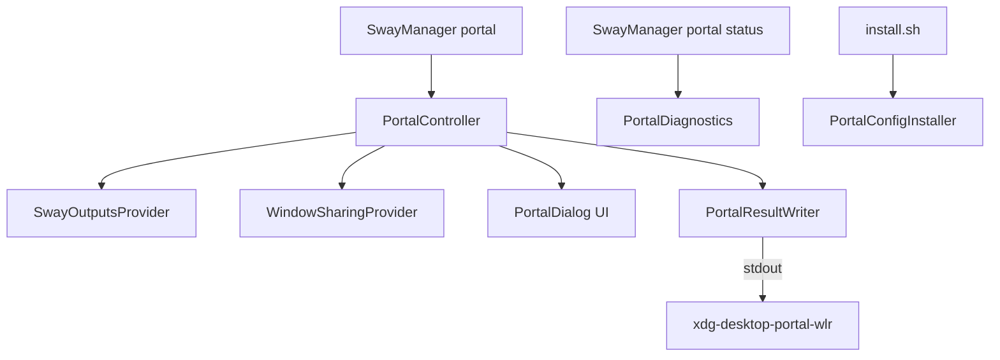

# Module Spec: Portal Subsystem (`src/portal/`)

## 1. Module Overview
Dedicated package managing XDG Desktop Portal ScreenCast selection, source discovery (monitors and top-level windows), environment diagnostics, configuration file installation, and stdout result formatting.

---

## 2. Package Architecture



---

## 3. Class Definitions & Responsibilities

### 3.1 `PortalResultWriter` (`portal/result_writer.py`)
Sole component authorized to write the result to `stdout`.
```python
class PortalResultWriter:
    def write_result(self, result: PortalResult) -> None: ...
    def write_monitor(self, output_name: str) -> None: ...
    def write_window(self, window_id: str) -> None: ...
    def cancel(self) -> None: ...
    @staticmethod
    def validate_identifier(identifier: str) -> bool: ...
```
- **Invariants**: Flushes stdout after writing line. Rejects identifiers containing newlines. Writes nothing on cancel.

### 3.2 `SwayOutputsProvider` (`portal/outputs_provider.py`)
Queries Sway IPC via `swaymsg -t get_outputs -r` to parse active monitors into `PortalSource` instances.

### 3.3 `WindowSharingProvider` (`portal/windows_provider.py`)
Returns a `WindowSharingAvailability` contract with a user-facing reason before attempting discovery. It requires Sway $\ge$ 1.12 and `lswt`; only then does it parse `lswt -j` into `PortalSource(source_type=WINDOW)` objects. It never substitutes Sway container IDs, titles, or `app_id` values as unsafe capture identifiers.

### 3.4 `PortalDiagnostics` (`portal/diagnostics.py`)
Performs pre-flight environment checks returning a `PortalDiagnosticsReport`:
- Wayland session check (`XDG_SESSION_TYPE`, `WAYLAND_DISPLAY`)
- Compositor detection (`sway`, `swayfx`)
- Window sharing support check
- PipeWire service check (`pipewire` / `pw-cli`)
- `systemctl --user is-active` for `xdg-desktop-portal` and `xdg-desktop-portal-wlr`
- D-Bus session variables exported (`WAYLAND_DISPLAY`, `XDG_CURRENT_DESKTOP`)

### 3.5 `PortalConfigInstaller` (`portal/config_installer.py`)
Manages deployment of portal configuration files:
- Updates `~/.config/xdg-desktop-portal/portals.conf`
- Updates `~/.config/xdg-desktop-portal-wlr/config`
- Appends `exec dbus-update-activation-environment` to `~/.config/sway/config` if missing
- Creates timestamped backups (`.bak`) before modification

### 3.6 `PortalController` (`portal/controller.py`)
Coordinates discovery, forwards window-capture availability reasons to `PortalDialog`, handles signal events, and emits results via `PortalResultWriter`. Note: `PortalController` is lazily imported in `portal/__init__.py` so that non-GUI tools (like `PortalConfigInstaller`) can run without requiring PySide6.

---

## 4. Testing Strategy
- `tests/test_portal.py` validates output formatting, multiline identifier rejection, availability reasons, Sway output parsing, window provider fallback, native-theme dialog behavior, explicit selection, keyboard activation, diagnostics report checks, config installer backup creation, and controller execution.
