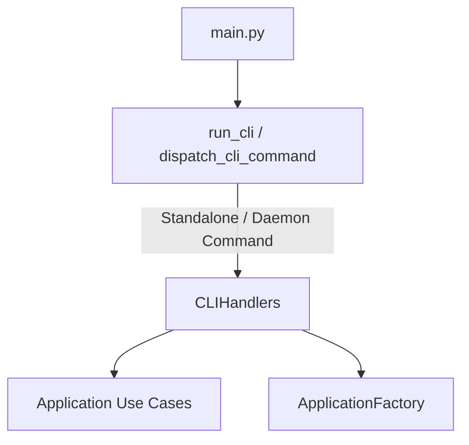

# Module Spec: Presentation Layer (`src/presentation/`)

## 1. Module Overview
Contains CLI entry point router/handlers and PySide6 graphical user interfaces (Control Center, Monitor Switcher, Wallpaper Picker, OSD overlays, Popups).

---

## 2. CLI Component Architecture (`presentation/cli/`)

- `router.py`: Handles CLI arguments (`sys.argv`), help output, daemon log monitoring, and dispatching. Bypasses daemon for local chooser operations (`SwayManager portal`).
- `handlers.py`: Static handler methods mapping CLI subcommands to application use cases or GUI windows.

---

## 3. GUI Component Architecture (`presentation/gui/`)

### 3.1 Application Factory (`app_factory.py`)
- Encapsulates `QApplication` initialization and lifecycle.
- Sets desktop file name (`QApplication.setDesktopFileName`).
- Enforces memory cleanup via `_cleanup_memory()`:
  - Clears `QPixmapCache`.
  - Triggers Python `gc.collect()`.
  - Invokes `malloc_trim(0)` on `libc.so.6`.

### 3.2 Windows & Widgets
- `ConfigCenterWindow`: Main macOS-styled control panel with sidebar navigation (`Monitores`, `Papel de Parede`, `Aparência & Tema`, `Bateria & Energia`, `Suspensão & Idle`, `Login & LightDM`).
- `MonitorSwapWindow`: Translucent frameless overlay for display mode switching.
- `WallpaperPickerWindow`: Grid view gallery for scanning and setting wallpaper.
- `BrightnessOSD` / `VolumeOSD`: Frameless translucent overlays that auto-dismiss after 2 seconds.
- `BrightnessPopup`: Interactive brightness slider popup.

### 3.3 Design System & Theme Styling (`styles.py`)
- Standardized styling system adhering to Apple Human Interface Guidelines (HIG).
- Unified palette functions: `get_colors("dark" | "light")`, `get_palette()`, `get_stylesheet()`.
- System font hierarchy using `-apple-system, BlinkMacSystemFont, SF Pro Text, SF Pro Display, Segoe UI, Roboto`.

---

## 4. UI Resilience & Memory Invariants
1. `WA_DeleteOnClose` set on all top-level windows.
2. Pixmap cache restricted to 2MB to prevent memory bloat on low-RAM devices.
3. Wayland reconnect flags enforced prior to `QApplication` instantiation.
